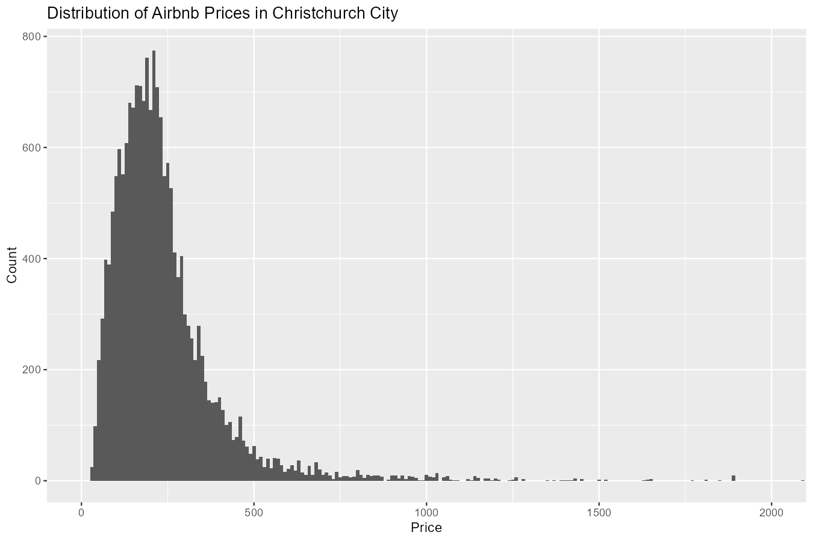
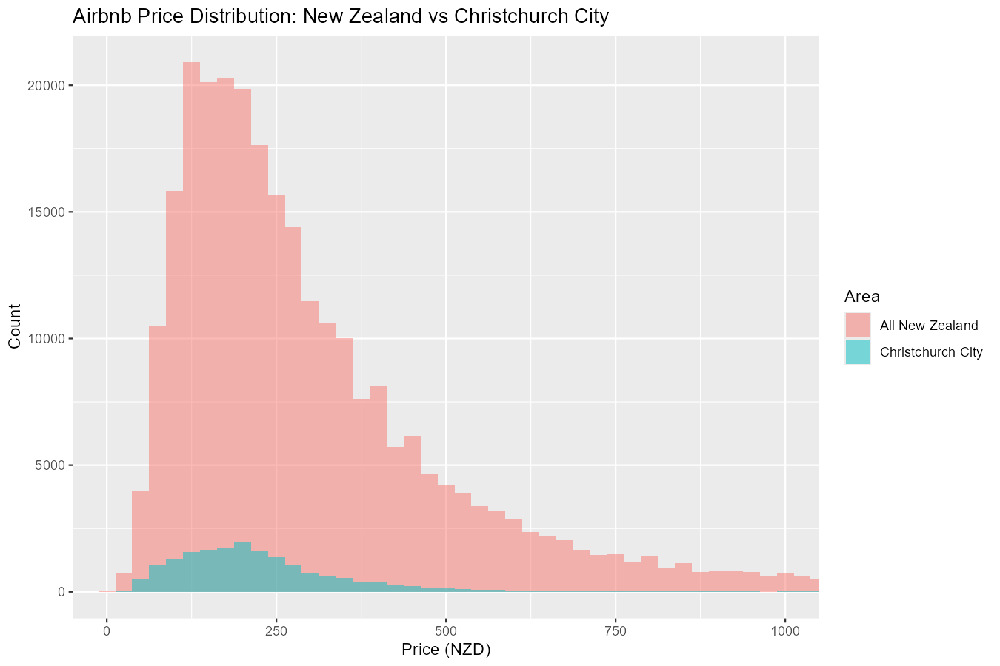
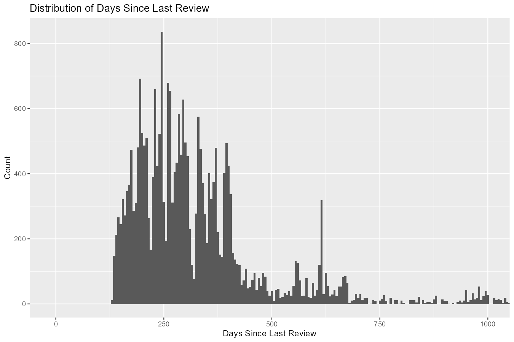
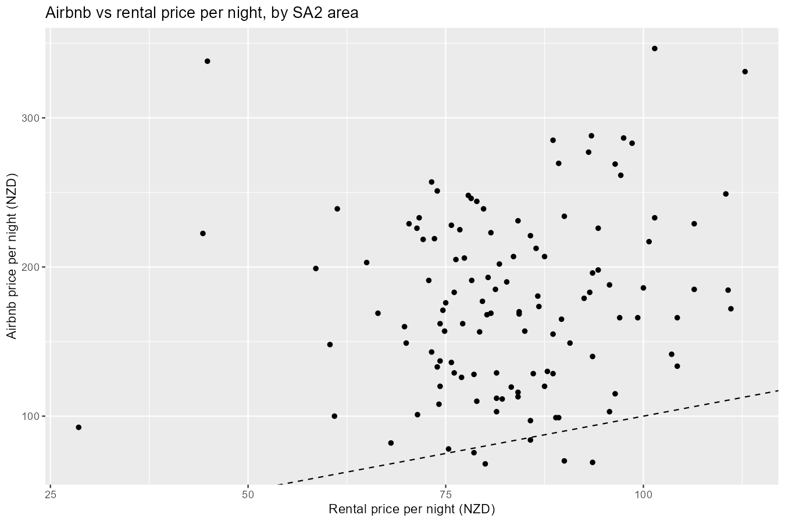
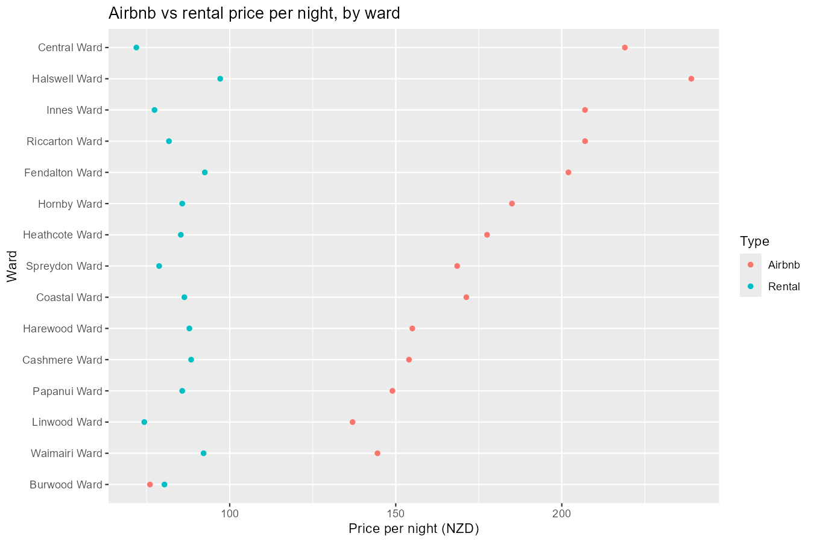
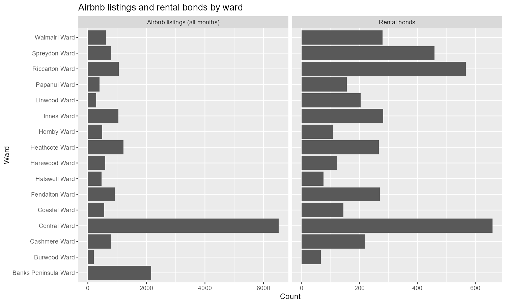



## Analysis Results

```{r}
#| label: load libraries
#| include: false


library(tidyverse)
library(ggplot2)
library(here)
library(knitr)

```

### AirBnB Price Distribution Plots

{fig-align="center" width="500"}

{fig-align="center" width="500"}

### AirBnB - Days Since Last Review

{fig-align="center"}

### AirBnB Top 10% of Reviews

TBD

### AirBnB Median Price Christchurch central

```{r}
#| label: median price chch central
#| echo: false

median_price_chch_central <- read_csv(here("03_output","airbnb_median_price_chch_central.csv" ),show_col_types = FALSE)

knitr::kable(median_price_chch_central, format = "markdown")
```



### Short and Long Term Rental Maximum Price Difference  





ADD IN EXTRACTED ROW FOR

### Short and Long Term Rental Number of Beds By Location  


